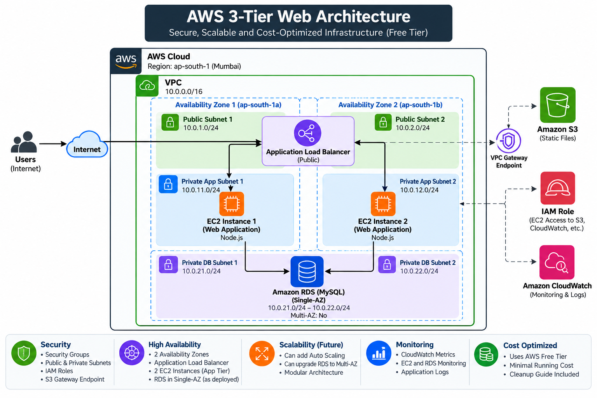

# AWS 3-Tier Web Architecture

A practical AWS 3-tier web application architecture deployed on Amazon Web Services (AWS), using an Application Load Balancer, private EC2 application servers, Amazon RDS MySQL, Amazon S3, IAM, and Amazon CloudWatch.

## Project Overview

This project demonstrates the deployment of a highly available and secure web application using a 3-tier architecture:

- **Presentation Layer:** Application Load Balancer (ALB)
- **Application Layer:** Two private EC2 instances running a Node.js application
- **Database Layer:** Private Amazon RDS MySQL database

The application servers are distributed across two Availability Zones. The ALB distributes incoming HTTP traffic between the EC2 instances and performs health checks on the application servers.

The EC2 instances access the private S3 bucket through an IAM role and retrieve a static CSS asset without storing AWS access keys on the servers.

Amazon CloudWatch CPU alarms are configured for both application servers, and a failure test was performed by stopping one EC2 instance while verifying that the application remained accessible through the other instance.

## Architecture

                         Internet
                            |
                            v
                +----------------------+
                | Application Load     |
                | Balancer (HTTP :80)  |
                +----------+-----------+
                           |
                 +---------+---------+
                 |                   |
                 v                   v
        +----------------+   +----------------+
        | EC2 App Server |   | EC2 App Server |
        |   faizan-app-01|   |   faizan-app-02|
        | Private Subnet |   | Private Subnet |
        | Node.js :3000  |   | Node.js :3000  |
        +-------+--------+   +--------+-------+
                |                     |
                +----------+----------+
                           |
                           v
                 +-------------------+
                 | Amazon RDS MySQL  |
                 | Private DB        |
                 | companydb         |
                 +-------------------+

             Private S3 Bucket
                    ^
                    |
              IAM EC2 Role
                    |
              EC2 App Servers

             Amazon CloudWatch
                    |
             EC2 CPU Monitoring

### Architecture Diagram



## Security

The architecture follows a layered security model:

- EC2 application servers are deployed in private subnets and do not have public IP addresses.
- The Application Load Balancer is deployed in public subnets and is the public entry point.
- Security Groups restrict traffic between the application tiers.
- ALB Security Group allows HTTP traffic on port 80.
- Application Security Group allows Node.js traffic on port 3000 only from the ALB Security Group.
- RDS Security Group allows MySQL traffic on port 3306 only from the Application Security Group.
- Amazon RDS is deployed in private database subnets with public access disabled.
- S3 Block Public Access is enabled.
- EC2 instances access S3 using an IAM role rather than storing AWS access keys.
- The EC2 IAM policy grants read access only to the project S3 bucket.
- EC2 Instance Connect Endpoint was used for private instance administration without assigning public IP addresses.

## Application

The web application is built using Node.js and Express.

### Features

- Displays application status
- Displays database connection status
- Retrieves employee records from MySQL
- Provides an ALB health-check endpoint at `/health`
- Retrieves a static CSS asset from the private S3 bucket
- Automatically initializes the database table and sample data when the application starts

### Database

The application uses Amazon RDS MySQL with the following database:

```text
Database: companydb
Table: employees
```

## Deployment

### Local Development

The application was developed and tested locally using:

- Node.js
- npm
- Express
- MySQL client library
- AWS SDK for JavaScript

### EC2 Deployment

The application was deployed to two private EC2 instances:

- `faizan-app-01`
- `faizan-app-02`

The Node.js application runs on port `3000`.

A `systemd` service is used to keep the application running:

three-tier-app.service

## Monitoring

Amazon CloudWatch is used to monitor CPU utilization of both application servers.

### CloudWatch Alarms

| Alarm | Metric | Threshold | Evaluation |
|---|---|---:|---|
| `faizan-app-01-high-cpu` | CPUUtilization | > 70% | 2 consecutive 5-minute periods |
| `faizan-app-02-high-cpu` | CPUUtilization | > 70% | 2 consecutive 5-minute periods |

Both alarms were verified in the **OK** state during testing.

No SNS notification was configured for this portfolio project.

## High Availability and Failure Testing

A failure test was performed to verify ALB failover behavior.

### Test Procedure

1. Stopped `faizan-app-01`.
2. Verified that `faizan-app-02` remained healthy.
3. Accessed the application through the ALB.
4. Confirmed that the application continued to load successfully.
5. Started `faizan-app-01` again.
6. Verified that the `systemd` service automatically started the Node.js application.
7. Waited for the ALB health check to pass.
8. Confirmed that both EC2 targets returned to **Healthy**.

### Result

The application remained available through the ALB while one application server was stopped, demonstrating traffic distribution and health-based target selection.

## Project Structure

```text
aws-3tier-web-architecture/
│
├── app/
│   ├── public/
│   │   └── style.css
│   ├── .gitignore
│   ├── package.json
│   ├── package-lock.json
│   └── server.js
│
├── database/
│   └── schema.sql
│
├── deployment/
│   ├── package.json
│   ├── package-lock.json
│   └── server.js
│
└── README.md
```

### Important Files

| File | Purpose |
|---|---|
| `app/server.js` | Main Node.js application |
| `app/public/style.css` | Static CSS asset stored in S3 |
| `database/schema.sql` | Database schema and sample data |
| `deployment/server.js` | Deployment copy of the application |
| `.gitignore` | Prevents secrets and generated files from being committed |

## Technologies Used

### AWS Services
- Amazon VPC
- Internet Gateway
- Application Load Balancer
- Amazon EC2
- Amazon RDS MySQL
- Amazon S3
- AWS IAM
- Amazon CloudWatch
- VPC Gateway Endpoint
- EC2 Instance Connect

### Application Technologies
- Node.js
- Express.js
- MySQL
- JavaScript
- AWS SDK for JavaScript

### Development Tools
- Git
- GitHub
- Visual Studio Code
- PowerShell

## Project Results

The project successfully demonstrated:

- Deployment of a Node.js web application on two private EC2 instances.
- Load balancing of application traffic using an Application Load Balancer.
- Secure communication between the application and private RDS MySQL database.
- Private S3 access using an EC2 IAM role and S3 Gateway Endpoint.
- Health monitoring of EC2 instances using CloudWatch alarms.
- Automatic application recovery through `systemd` after an EC2 restart.
- Application availability during an application-server failure test.
- Successful recovery of the stopped EC2 instance and return to a healthy ALB target state.

## AWS Resource Summary

| Resource | Name / Configuration |
|---|---|
| VPC | `faizan-3tier-vpc` |
| CIDR | `10.0.0.0/16` |
| Availability Zones | `ap-south-1a`, `ap-south-1b` |
| Application Load Balancer | `faizan-3tier-alb` |
| Target Group | `faizan-3tier-tg` |
| EC2 Instance 1 | `faizan-app-01` |
| EC2 Instance 2 | `faizan-app-02` |
| EC2 Type | `t3.micro` |
| Operating System | Amazon Linux 2023 |
| RDS | `faizan-3tier-db` |
| Database Engine | MySQL |
| Database | `companydb` |
| S3 Bucket | `faizan-3tier-static-2026-0108` |
| IAM Role | `faizan-3tier-ec2-role` |
| S3 VPC Endpoint | `faizan-s3-endpoint` |
| EIC Endpoint | `faizan-eic-endpoint` |
| CloudWatch Alarms | 2 CPU utilization alarms |

## Troubleshooting and Lessons Learned

During the implementation, several practical AWS and deployment issues were encountered and resolved:

- RDS instance creation initially encountered Availability Zone capacity limitations, so the instance configuration was adjusted to a supported configuration.
- Private EC2 instances were accessed using an EC2 Instance Connect Endpoint without assigning public IP addresses.
- RDS connectivity was tested from both application servers before deploying the application.
- Node.js was installed on the Amazon Linux EC2 instances using a compatible Linux Node.js package.
- The application was configured as a `systemd` service to provide automatic startup and restart behavior.
- S3 access was configured through an IAM role instead of storing AWS access keys on EC2 instances.
- Windows-created deployment files caused permission issues after extraction on Linux; file ownership and permissions were corrected on the EC2 instances.
- ALB health checks were tested using the `/health` endpoint.
- An EC2 failure scenario was tested by stopping one application server and verifying that the ALB continued serving the application through the healthy instance.

## Cost Management and Cleanup

This project was designed with cost awareness in mind.

The following practices were used:

- Small EC2 instance types were used for the application servers.
- RDS storage was kept at the minimum practical size for the project.
- A NAT Gateway was not used to avoid unnecessary data-processing and hourly charges.
- An S3 Gateway Endpoint was used for private S3 access without requiring a NAT Gateway.
- AWS resources can be stopped or deleted after testing to prevent unnecessary ongoing charges.
- The project environment was tested and documented before cleanup.

> **Note:** AWS services such as EC2, RDS, Application Load Balancer, and EC2 Instance Connect Endpoint may incur charges depending on the account, region, and applicable Free Tier eligibility. Always verify current AWS pricing before deploying resources.

## Skills Demonstrated

This project demonstrates practical experience with:

- AWS VPC and subnet design
- Public and private subnet configuration
- Route tables and Internet Gateway
- Application Load Balancer and target groups
- EC2 instance deployment and administration
- Linux system administration
- Node.js application deployment
- Amazon RDS MySQL configuration
- MySQL database connectivity
- Amazon S3 and private object access
- IAM roles and least-privilege permissions
- VPC Gateway Endpoints
- Security Groups and network access control
- CloudWatch monitoring and alarms
- Systemd service management
- Git and GitHub
- AWS troubleshooting and failure testing

## Author

**Md Faizan Sheikh**

MCA | AWS & Cloud Computing

GitHub: [Md-FaizanSheikh](https://github.com/Md-FaizanSheikh)

---

## Disclaimer

This project was created as an academic and portfolio project to demonstrate practical AWS cloud, networking, Linux administration, application deployment, security, and monitoring concepts.